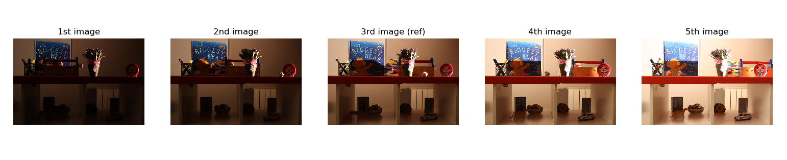

# multi-exposure image stack for HDRI

According to the README.txt, this dataset contains a set of RAW and JPEG image stacks of multi-exposure image sequences that could be used for testing HDR reconstruction and deghosting methods. The **unique** feature of this dataset is that it contains both test image stacks, with motion and misalignment, and motion-free reference image stacks, which can be used with full-reference image quality metrics. 

The complete dataset consists of 36 scenes, provided as:
* RAW (*Canon*) image stacks
* JPEG image stacks
* Merged HDR image (*based on several methods*)

The 36 scenes are organized into **9** categories of motion types, each containing **4** image sets. The category of the motion types are as follow. 

| type          | description               | 
| --            | --                        |
| complex       | Highly dynamic scene with small/large motion displacement of small/large objects, non-rigid motion, occlusion, and several independently moving objects |
| hand-hold     | Static scene captured with a hand-hold camera |
| lolm          | Large object displacement with large motion   |
| losm          | Large object displacement with small motion   |
| multiview     | Multi-view sequence of a static scene         |
| nrm           | Motion of non-rigid and high texture objects  |
| occlusion     | Scene containing occlusion                    |
| solm          | Small object displacement with large motion   |
| sosm          | Small object displacement with small motion   |

## example images (type complex)



## tree structure

```tree
dataset
|__ exposure_stacks_part1
|   |__ exposure_stacks_part1
|   |   |__ complex
|   |   |   |__ image_set[1:4]
|   |   |   |   |__ ghosted
|   |   |   |   |   |__ jpg
|   |   |   |   |   |   |__ setup[1,2,3,4]_complex_[1:5].jpg
|   |   |   |   |   |__ raw
|   |   |   |   |   |   |__ setup[1,2,3,4]_complex_[1:5].cr2
|   |   |   |   |__ ground_truth
|   |   |   |   |   |__ jpg
|   |   |   |   |   |   |__ setup[1,2,3,4]_complex_gt[1:5].jpg
|   |   |   |   |   |__ raw
|   |   |   |   |   |   |__ setup[1,2,3,4]_complex_gt[1:5].cr2
|   |   |__ handheld
|   |   |   |__ image_set[1:4]
|   |   |   |   |__ ghosted
|   |   |   |   |   |__ jpg
|   |   |   |   |   |   |__ setup[1,2,3,4]_handheld_[1:5].jpg
|   |   |   |   |   |__ raw
|   |   |   |   |   |   |__ setup[1,2,3,4]_handheld_[1:5].cr2
|   |   |   |   |__ ground_truth
|   |   |   |   |   |__ jpg
|   |   |   |   |   |   |__ setup[1,2,3,4]_handheld_gt[1:5].jpg
|   |   |   |   |   |__ raw
|   |   |   |   |   |   |__ setup[1,2,3,4]_handheld_gt[1:5].cr2
|   |   |__ lolm
|   |   |   |__ image_set[1:4]
|   |   |   |   |__ ghosted
|   |   |   |   |   |__ jpg
|   |   |   |   |   |   |__ setup[1,2,3,4]_lolm_[1:5].jpg
|   |   |   |   |   |__ raw
|   |   |   |   |   |   |__ setup[1,2,3,4]_lolm_[1:5].cr2
|   |   |   |   |__ ground_truth
|   |   |   |   |   |__ jpg
|   |   |   |   |   |   |__ setup[1,2,3,4]_lolm_gt[1:5].jpg
|   |   |   |   |   |__ raw
|   |   |   |   |   |   |__ setup[1,2,3,4]_lolm_gt[1:5].cr2
|__ exposure_stacks_part2
|   |__ exposure_stacks_part2
|   |   |__ losm
|   |   |   |__ [same above]
|   |   |__ multiview
|   |   |   |__ [same above]
|   |   |__ nrm
|   |   |   |__ [same above]
|__ exposure_stacks_part3
|   |__ exposure_stacks_part3
|   |   |__ occlusion
|   |   |   |__ [same above]
|   |   |__ solm
|   |   |   |__ [same above]
|   |   |__ sosm
|   |   |   |__ [same above]
|__ merged_hdr_images_part1
|   |__ merged_hdr_images_part1
|   |   |__ complex
|   |   |   |__ image_set[1:4]
|   |   |   |   |__ deghosted
|   |   |   |   |   |__ hu_setup[1,2,3,4]_complex.hdr
|   |   |   |   |   |__ nodegh_setup[1,2,3,4]_complex.hdr
|   |   |   |   |   |__ photomatix_setup[1,2,3,4]_complex.hdr
|   |   |   |   |   |__ photoshop_setup[1,2,3,4]_complex.hdr
|   |   |   |   |   |__ sen_setup[1,2,3,4]_complex.hdr
|   |   |   |   |   |__ silk_setup[1,2,3,4]_complex.hdr
|   |   |   |   |__ ground_truth
|   |   |   |   |   |__ hu_setup[1,2,3,4]_complex.hdr
|   |   |   |   |   |__ nodegh_setup[1,2,3,4]_complex.hdr
|   |   |   |   |   |__ photomatix_setup[1,2,3,4]_complex.hdr
|   |   |   |   |   |__ photoshop_setup[1,2,3,4]_complex.hdr
|   |   |   |   |   |__ sen_setup[1,2,3,4]_complex.hdr
|   |   |   |   |   |__ silk_setup[1,2,3,4]_complex.hdr
|   |   |__ handheld
|   |   |   |__ image_set[1:4]
|   |   |   |   |__ deghosted
|   |   |   |   |   |__ hu_setup[1,2,3,4]_handheld.hdr
|   |   |   |   |   |__ nodegh_setup[1,2,3,4]_handheld.hdr
|   |   |   |   |   |__ photomatix_setup[1,2,3,4]_handheld.hdr
|   |   |   |   |   |__ photoshop_setup[1,2,3,4]_handheld.hdr
|   |   |   |   |   |__ sen_setup[1,2,3,4]_handheld.hdr
|   |   |   |   |   |__ silk_setup[1,2,3,4]_handheld.hdr
|   |   |   |   |__ ground_truth
|   |   |   |   |   |__ hu_setup[1,2,3,4]_handheld.hdr
|   |   |   |   |   |__ nodegh_setup[1,2,3,4]_handheld.hdr
|   |   |   |   |   |__ photomatix_setup[1,2,3,4]_handheld.hdr
|   |   |   |   |   |__ photoshop_setup[1,2,3,4]_handheld.hdr
|   |   |   |   |   |__ sen_setup[1,2,3,4]_handheld.hdr
|   |   |   |   |   |__ silk_setup[1,2,3,4]_handheld.hdr
|   |   |__ lolm
|   |   |   |__ image_set[1:4]
|   |   |   |   |__ deghosted
|   |   |   |   |   |__ hu_setup[1,2,3,4]_lolm.hdr
|   |   |   |   |   |__ nodegh_setup[1,2,3,4]_lolm.hdr
|   |   |   |   |   |__ photomatix_setup[1,2,3,4]_lolm.hdr
|   |   |   |   |   |__ photoshop_setup[1,2,3,4]_lolm.hdr
|   |   |   |   |   |__ sen_setup[1,2,3,4]_lolm.hdr
|   |   |   |   |   |__ silk_setup[1,2,3,4]_lolm.hdr
|   |   |   |   |__ ground_truth
|   |   |   |   |   |__ hu_setup[1,2,3,4]_lolm.hdr
|   |   |   |   |   |__ nodegh_setup[1,2,3,4]_lolm.hdr
|   |   |   |   |   |__ photomatix_setup[1,2,3,4]_lolm.hdr
|   |   |   |   |   |__ photoshop_setup[1,2,3,4]_lolm.hdr
|   |   |   |   |   |__ sen_setup[1,2,3,4]_lolm.hdr
|   |   |   |   |   |__ silk_setup[1,2,3,4]_lolm.hdr
|__ merged_hdr_images_part2
|   |__ merged_hdr_images_part2
|   |   |__ losm
|   |   |__ multiview
|   |   |__ nrm
|   |   |   |__ [same above]
|__ merged_hdr_images_part3
|   |__ merged_hdr_images_part3
|   |   |__ occlusion
|   |   |__ solm
|   |   |__ sosm
|   |   |   |__ [same above]
|__ pairwise_comparison_results
|   |__ pairwise_comparison_results
|   |   |__ image_set1_JND_pw_scale.eps
|   |   |__ image_set1_JND_pw_scale.png
|   |   |__ image_set2_JND_pw_scale.eps
|   |   |__ image_set2_JND_pw_scale.png
|   |   |__ image_set3_JND_pw_scale.eps
|   |   |__ image_set3_JND_pw_scale.png
|   |   |__ image_set4_JND_pw_scale.eps
|   |   |__ image_set4_JND_pw_scale.png
|   |   |__ subjects_inputs.csv
|__ README.txt
```